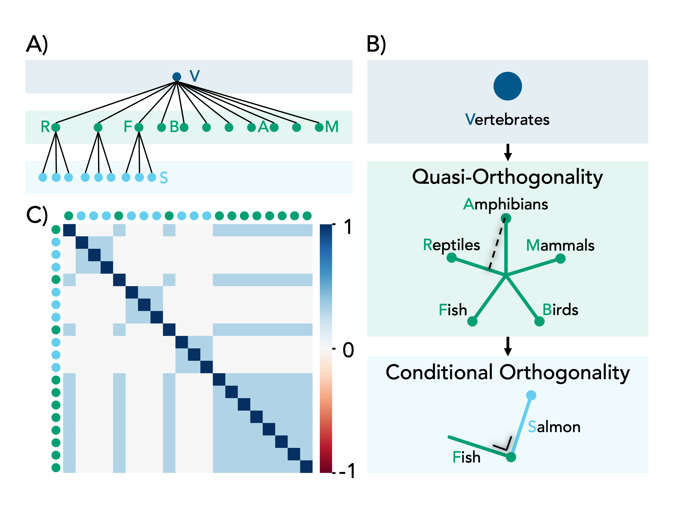

# MP-SAE

This repository accompanies the NeurIPS 2025 paper:
<div align="center">

### **From Flat to Hierarchical: Extracting Sparse Representations with Matching Pursuit**

**Valérie Costa · Thomas Fel · Ekdeep Singh Lubana · Bahareh Tolooshams · Demba E. Ba**

[OpenReview](https://openreview.net/forum?id=Ll5miDx8KB) · [NeurIPS](https://neurips.cc/virtual/2025/loc/san-diego/poster/118531)

</div>

```bibtex
@inproceedings{
costa2025from,
title={From Flat to Hierarchical: Extracting Sparse Representations with Matching Pursuit},
author={Val{\'e}rie Costa and Thomas Fel and Ekdeep Singh Lubana and Bahareh Tolooshams and Demba E. Ba},
booktitle={The Thirty-ninth Annual Conference on Neural Information Processing Systems},
year={2025},
url={https://openreview.net/forum?id=Ll5miDx8KB}
}
```

> ⚠️ **Credit**: The majority of this codebase is adapted from the original implementation by [Noa Nabeshima](https://github.com/noanabeshima/matryoshka-saes), accompanying the paper:
> **["Learning Multi-Level Features with Matryoshka Sparse Autoencoders"](https://arxiv.org/abs/2503.17547)**
> *Bart Bussmann, Noa Nabeshima, Adam Karvonen, Neel Nanda*

## 🧠 About This Project

In this work, we revisit the assumptions underlying conventional sparse autoencoders—such as global quasi-orthogonality—and propose **MP-SAE**, a novel architecture that encourages *conditional orthogonality* through a residual-guided, greedy inference process inspired by Matching Pursuit.

To evaluate our model, we extend the synthetic benchmark introduced by Matryoshka SAEs and compare MP-SAE against several standard variants.


## ⚙️ Implementation Notes

MP-SAE supports two inference modes, depending on the experimental setting and how sparsity is controlled.

### 1. Threshold-based unrolling

In the synthetic toy experiments, the greedy inference process is unrolled until the residual reaches a predefined threshold or the support no longer changes. This allows different inputs to have different sparsity levels and does not rely on a fixed sparsity target.

### 2. Fixed-step unrolling

For large-scale experiments, we use the fixed-step version of MP-SAE. Here, the number of unrolling steps is fixed in advance, which directly controls the target sparsity level.

This is the version used for the large-scale vision experiments in our paper and the one implemented in the [**overcomplete SAE library**](https://github.com/KempnerInstitute/overcomplete):

* [https://github.com/KempnerInstitute/overcomplete/blob/main/overcomplete/sae/mp_sae.py](https://github.com/KempnerInstitute/overcomplete/blob/main/overcomplete/sae/mp_sae.py)

<p style="color:red"><strong>Important:</strong> We recommend using this fixed-step implementation for large-scale settings, as the threshold-based version does not scale as well.</p>

> **Dropout:** Randomly masking a percentage of dictionary elements in the early training iterations can help reduce dead neurons and limit over-reliance on early greedy selections. See the [overcomplete implementation](https://github.com/KempnerInstitute/overcomplete/blob/main/overcomplete/sae/mp_sae.py).


## 🧩 Synthetic Toy Hierarchy

We benchmark four SAE variants—Vanilla, BatchTopK, Matryoshka, and our proposed MP-SAE—on a two-level tree hierarchy of concepts. This setup builds upon the synthetic experiment from the Matryoshka SAE paper with the following key modifications:

* Ground-truth features are generated with explicit control over intra-level correlations.
* Children nodes are mutually exclusive (only one can be active at a time).
* We introduce variance in the code activations so that parent and child activation strengths are not perfectly correlated.




## 📄 Citation

If you use this codebase, please cite both our work and the original Matryoshka SAE paper:

### Matching Pursuit Sparse Autoencoders (this work)

```bibtex
@inproceedings{
costa2025from,
title={From Flat to Hierarchical: Extracting Sparse Representations with Matching Pursuit},
author={Val{\'e}rie Costa and Thomas Fel and Ekdeep Singh Lubana and Bahareh Tolooshams and Demba E. Ba},
booktitle={The Thirty-ninth Annual Conference on Neural Information Processing Systems},
year={2025},
url={https://openreview.net/forum?id=Ll5miDx8KB}
}
```

### Matryoshka Sparse Autoencoders

```bibtex
@inproceedings{
bussmann2025learning,
title={Learning Multi-Level Features with Matryoshka Sparse Autoencoders},
author={Bart Bussmann and Noa Nabeshima and Adam Karvonen and Neel Nanda},
booktitle={Forty-second International Conference on Machine Learning},
year={2025},
url={https://openreview.net/forum?id=m25T5rAy43}
}
```
